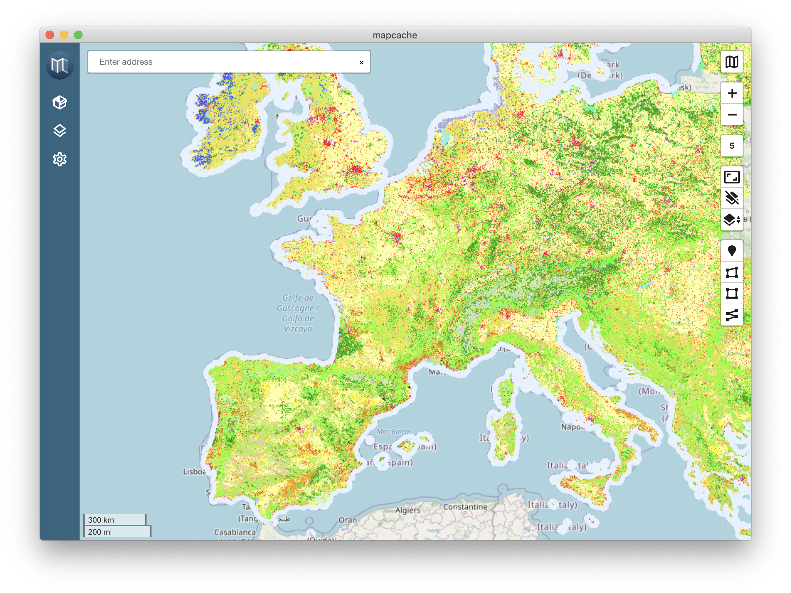

# MapCache Desktop

# About
MapCache Desktop is a desktop application running in Electron, built for Windows, Linux, and MacOS, providing the ability to create GeoPackages from geospatial data sources. Supported geospatial data formats include WMS, WFS, XYZ, GeoTIFF, KMZ/KML, GeoJSON, and SHP.

# Setting Up a Development Environment
These instructions were written for development on mac.

You need a basic understanding of the following tools that you should install via package manager (brew, apt, etc.):  
* git 2.25.0
* npm 6.14.4
* yarn 0.21.3
* node 12.16.3
* Xcode 11.3 or greater

# Building and Running MapCache Desktop
Once you have set up a development environment, these steps will let you build and run MapCache:
1. Download the code:  
`git clone https://github.com/ngageoint/mapcache-electron.git && cd mapcache-electron`
2. Install dependencies:  
`yarm`
3. Run:  
`yarn electron:serve` (run locally in development mode)

# Cleaning MapCache Desktop
The MapCache Desktop build and runtime processes will generate several files. The following commands will help cleanup your environment.
* Remove previously built resources:  
`rm -rf dist_electron`
* To remove the MapCache Desktop development runtime application data:  
`rm -rf ~/Library/Application\ Support/Electron`
* To remove the MapCache Desktop production runtime application data:  
`rm -rf ~/Library/Application\ Support/MapCache`
* To remove all the client (javascript) dependencies installed by `npm run install` use:  
`rm -rf node_modules`

# Logging, Debugging, Building, and Testing

## Logging
The application uses https://www.npmjs.com/package/electron-log for logging.

Log files can be found:
1. on Linux: ~/.config/MapCache/logs/{process type}.log
2. on macOS: ~/Library/Logs/MapCache/{process type}.log
3. on Windows: %USERPROFILE%\AppData\Roaming\{app name}\logs\{process type}.log

where `process type` can be one of `(renderer, main)`

## Debugging
The application is broken up into a main process and renderer processes inside of electron. 

The renderer processes can be debugged using the chrome developer tools.

# Building MapCache
The following will help you create binaries for windows, linux, and macOS. Due to native libraries within the application, each build must occur on its specific platform.  

1. Build Windows
`yarn electron:build-win`
2. Build Linux
`yarn electron:build-linux`
3. Build Mac
`yarn electron:build-mac`
4. Build All
`yarn electron:build`
4. The newly created installers are located in the build folder:  
`cd dist_electron`

# Limitations and Notes
It is worth noting that there are several libraries using native dependencies. The native depdencies are
1. better-sqlite3
2. node-gdal
3. canvas

Better-sqlite3 also has a dependency on the bindings library which currently has a bug preventing the loading on native libraries in electron 9. A pull request has been submitted but until bindings updates and better-sqlite3 updates to that version, `npm shrinkwrap` is used to inject a working version.

## Testing
Any changes made in development should be tested in the production version of the application for all supported platforms.

### Pull Requests ###
If you'd like to contribute to this project, please make a pull request. We'll review the pull request and discuss the changes. All pull request contributions to this project will be released under the MIT license.

Software source code previously released under an open source license and then modified by NGA staff is considered a "joint work" (see 17 USC § 101); it is partially copyrighted, partially public domain, and as a whole is protected by the copyrights of the non-government authors and must be released according to the terms of the original open source license.

## License

The MIT License (MIT)

Copyright (c) 2020 National Geospatial-Intelligence Agency

Permission is hereby granted, free of charge, to any person obtaining a copy
of this software and associated documentation files (the "Software"), to deal
in the Software without restriction, including without limitation the rights
to use, copy, modify, merge, publish, distribute, sublicense, and/or sell
copies of the Software, and to permit persons to whom the Software is
furnished to do so, subject to the following conditions:

The above copyright notice and this permission notice shall be included in all
copies or substantial portions of the Software.

THE SOFTWARE IS PROVIDED "AS IS", WITHOUT WARRANTY OF ANY KIND, EXPRESS OR
IMPLIED, INCLUDING BUT NOT LIMITED TO THE WARRANTIES OF MERCHANTABILITY,
FITNESS FOR A PARTICULAR PURPOSE AND NONINFRINGEMENT. IN NO EVENT SHALL THE
AUTHORS OR COPYRIGHT HOLDERS BE LIABLE FOR ANY CLAIM, DAMAGES OR OTHER
LIABILITY, WHETHER IN AN ACTION OF CONTRACT, TORT OR OTHERWISE, ARISING FROM,
OUT OF OR IN CONNECTION WITH THE SOFTWARE OR THE USE OR OTHER DEALINGS IN THE
SOFTWARE.

### Acknowledgements
Earth image
https://unsplash.com/photos/Q1p7bh3SHj8
